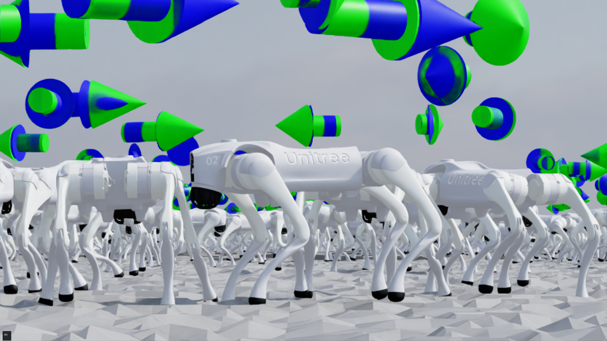
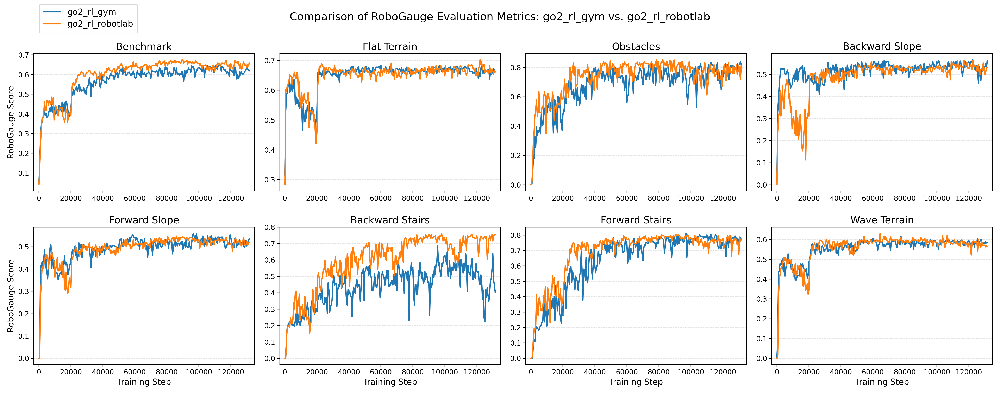

<div align="center">
	<h1 align="center">Go2 RL RobotLab</h1>
	<a href="https://robogauge.github.io/complete/">
		
	</a>
	<a href="https://robogauge.github.io/static/files/arxiv.pdf">
		
	</a>
	<a href="https://arxiv.org/abs/2602.00678">
		
	</a>
	<a href="https://github.com/wty-yy/go2_rl_gym">
		
	</a>
</div>

## Overview

Train a Unitree Go2 robot in IsaacLab, and deploy policy to MuJoCo for Sim2Sim. For more, see the [project page](https://robogauge.github.io/complete/).

It is an official [MoE-CTS](https://robogauge.github.io/static/files/arxiv.pdf) algorithm implementation in IsaacLab / RobotLab, as a reproduction of [go2_rl_gym](https://github.com/wty-yy/go2_rl_gym).

---

<p align="center">
  
</p>

---

## Demos

<p align="center">
  <b>Train in IsaacLab → validate with MuJoCo Sim2Sim → evaluate on the real Unitree Go2.</b>
</p>

<table>
  <tr>
    <td width="50%" align="center">
      <b>IsaacLab Play</b><br/>
      <sub>Policy rollout in the IsaacLab environment.</sub><br/><br/>
      
    </td>
    <td width="50%" align="center">
      <b>MuJoCo Sim2Sim</b><br/>
      <sub>Exported policy running in MuJoCo before real-world deployment.</sub><br/><br/>
      
    </td>
  </tr>
  <tr>
    <td width="50%" align="center">
      <b>Real Robot</b><br/>
      <sub>Robust walking front on stairs.</sub><br/><br/>
      
    </td>
    <td width="50%" align="center">
      <b>Real Robot</b><br/>
      <sub>Robust walking sideways on stairs.</sub><br/><br/>
      
    </td>
  </tr>
</table>

---

## RoboGauge Benchmark

<p align="center">
  <b><a href="https://github.com/wty-yy/RoboGauge">RoboGauge</a> score comparison between go2_rl_robotlab and the original go2_rl_gym.</b>
</p>

<p align="center">
  
</p>

### Algorithm Results (Best of 150k training steps)

| Model | Score | Tracking  | Safety  | Quality  | Level |
| --- | --- | --- | --- | --- | --- |
| go2_moe_cts (go2_rl_robotlab) | **0.6828** | **0.6785** | 0.7552 | **0.7645** | **8.17** |
| go2_moe_cts (go2_rl_gym) | **0.6713** | 0.6669 | **0.7857** | 0.7392 | 7.85 |
| [CTS](https://arxiv.org/pdf/2405.10830) vanilla | 0.5786 | 0.5755 | 0.7066 | 0.6624 | 6.83 |
| [HIM](https://github.com/InternRobotics/HIMLoco) | 0.5379 | 0.5453 | 0.6476 | 0.6050 | 6.19 |
| [DreamWaQ](https://arxiv.org/abs/2301.10602) | 0.5054 | 0.5105 | 0.6149 | 0.5730 | 5.74 |

---

## Installation Guide

### 1. Install IsaacLab

Install IsaacLab follow [official guide](https://isaac-sim.github.io/IsaacLab/v2.3.2/source/setup/installation/isaaclab_pip_installation.html):

```bash
conda create -n go2_rl_robotlab python=3.11
conda activate go2_rl_robotlab
pip install --upgrade pip
pip install isaaclab[isaacsim,all]==2.3.2.post1 --extra-index-url https://pypi.nvidia.com
pip install -U torch==2.7.0 torchvision==0.22.0 --index-url https://download.pytorch.org/whl/cu128
```

---

### 2. Install Customized RSL-RL and RobotLab

We uses a customized version of `rsl_rl==3.3.0` and `robot_lab==2.3.0`. Install them in editable mode:

```bash
python -m pip install -e source/robot_lab
python -m pip install -e source/rsl_rl
```

---

### 3. Install MuJoCo (Optional, for Sim2Sim)

To enable MuJoCo-based simulation:

```bash
pip install mujoco pygame  # tested on 3.4.0 and 3.6.0
```

---

## Training and Evaluation

Run the following commands:

```bash
# Train
python scripts/rsl_rl/train.py --task=RobotLab-Go2-v0 --headless

# Evaluate
python scripts/rsl_rl/play.py --task=RobotLab-Go2-v0
```

---

### Training with RoboGauge Evaluation

[RoboGauge](https://github.com/wty-yy/robogauge) provides an asynchronous suite for evaluating motion-control reinforcement learning policies, helping you select the best model. After installing RoboGauge by following the [installation guide](https://github.com/wty-yy/robogauge?tab=readme-ov-file#installation), start the RoboGauge server:

```bash
python robogauge/scripts/server.py --port 9973 --num-processes 32
```

In another terminal, start your training with RoboGauge evaluation enabled:

```bash
# Train
python scripts/rsl_rl/train.py --task=RobotLab-Go2-v0 --headless --robogauge --robogauge_port 9973
```

Note on Asynchronous Evaluation:

Since the evaluation runs asynchronously, the training loop receives the results from the previous evaluation in the next iteration. If evaluation is slower than training, tasks will be queued. Upon training completion, the process will wait for all remaining evaluation tasks to finish before exiting.

Performance Example: On a system with an AMD EPYC 7763 and RTX 4090, a full evaluation takes approximately 5 minutes with num_processes=63. Training and saving checkpoints every 500 steps typically takes around 30 minutes.

---

## Configuration

The training pipeline can be configured at two levels: task-level Python configuration files and runtime arguments passed to the training script.

### Task-Level Configuration

The default task settings are defined in the following files:

1. **Environment configuration**
   ```
   source/robot_lab/robot_lab/tasks/go2/env_cfg.py
   ```

2. **RL algorithm configuration**
   ```
   source/robot_lab/robot_lab/tasks/go2/rsl_rl_cfg.py
   ```

3. **Task registration**
   ```
   source/robot_lab/robot_lab/tasks/go2/__init__.py
   ```

### Runtime Overrides

In addition to the default configuration files, `train.py` and `play.py` supports several command-line arguments for runtime overrides:

```bash
python scripts/rsl_rl/train.py \
   --task=RobotLab-Go2-v0 \
   --headless \
   --experiment_name <YOUR_EXP_NAME> \
   --run_name <YOUR_RUN_NAME> \
   --num_envs <NUM_ENVS> \
   --checkpoint <PATH_TO_CHECKPOINT>
```

For more details, refer to the [robot_lab repo](https://github.com/fan-ziqi/robot_lab.git).

---

## MuJoCo Sim2Sim

Set the `policy_path` in `deploy/deploy_mujoco/configs/go2.yaml`:

```yaml
policy_path: "{ROOT_DIR}/deploy/pre_train/go2/xxx.pt" # policy.pt exported by running scripts/rsl_rl/play.py
```

Run the deployment script:

```bash
python deploy/deploy_mujoco/deploy_go2.py
```

### Controller Behavior

- **Automatic detection**: If a controller is connected, control mode is enabled automatically.
- **Fallback mode**: If no controller is detected, default commands from the config file are used.

### Controller Mapping

| Input | Function |
|------|--------|
| `LX / LY` | Forward / lateral velocity |
| `RX` | Angular velocity (steering) |

---

### Switching Simulation Scenarios

Modify `xml_path` in `deploy/deploy_mujoco/config/go2.yaml`:

```yaml
# Flat terrain
xml_path: "{ROOT_DIR}/resources/go2/flat.xml"

# Stairs
xml_path: "{ROOT_DIR}/resources/go2/stairs.xml"

# Boxes
xml_path: "{ROOT_DIR}/resources/go2/boxes.xml"

# Custom
xml_path: "{ROOT_DIR}/resources/go2/your-custom-scene.xml"
```

---

## Differences from `go2_rl_gym`

- Motor:
  - use official unitree motor model instead of simple PD controller
- Rewards:
  - different tracking reward form (fixed sigma vs. dynamic sigma)
  - lower joint_acc_l2 weight in Lab due to physics-step level implementation and sensitivity to outliers
  - extra joint_pos_penalty_l1 reward in Lab due to better performance
- Domain randomization: 
  - no randomized action delay, use motor-level delay instead
  - no motor strength randomization due to implementation constraints in Lab.

---

## Acknowledgements
This repository would not exist without the following open-source projects:

- [isaac_lab](https://github.com/isaac-sim/IsaacLab): Unified framework for robot learning built on NVIDIA Isaac Sim.
- [rsl_rl](https://github.com/leggedrobotics/rsl_rl.git): Reinforcement learning algorithms.
- [robot_lab](https://github.com/fan-ziqi/robot_lab.git): RL Extension Library for Robots, Based on IsaacLab.
- [mujoco](https://github.com/google-deepmind/mujoco.git): High-performance CPU physics simulator.

Related publications implemented in this repo:
- [CTS: Concurrent Teacher-Student Reinforcement Learning for Legged Locomotion](https://arxiv.org/pdf/2405.10830)
